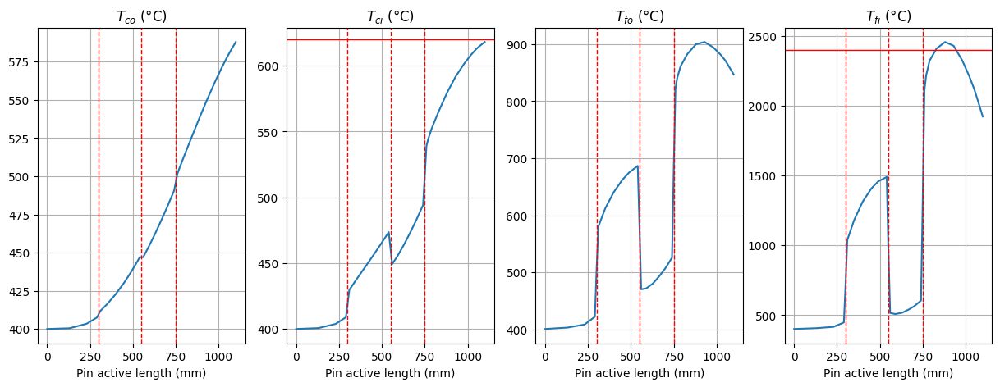
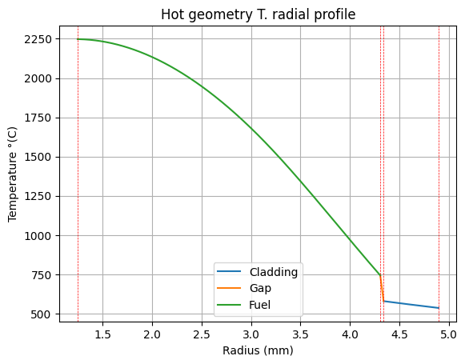
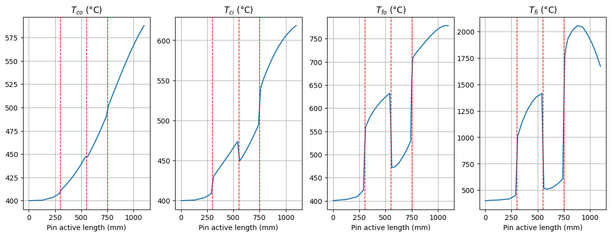

# Results report
It is useful to remember that the aim of this preliminary analysis was the design of:
*   the	thickness	of	the	cladding,
*   the	size	of	the	fuel-cladding	gap,
*   the	height	of	the	plena,

while the boundaries to be osserved were the:
*   temperature of	the	cladding,
*   yielding of	the	cladding,
*   creep strain of	the	cladding,
*   margin to	melting of	the	fuel.

**Thickness of the cladding**

First of all, a thickness of the cladding was proposed (**0.55 mm**) and *a posteriori* verified. To do so, the axial temperature profile under different approaches.

1) **cold geometry**: 
it's the temperature profile under the hypothesis that the pin is not deformed in any way. It is hence a rough approximation.

As shown, the cladding midwall temperature limit of 620°C is respected since it is not reached in the hottest point of the whole cladding. The same can't be said about the fuel, since the 2400°C threshold is exceeded at the inner surface of the fuel.
Still, the cold geometry is not a realistic representation but it is only worth displying since it is easy to implement and consists of a first step towards more proper approaches.
Moreover, a less approximate radial analysis of the temperature profile (developed in the axial point with higher inner fuel temperature) shows that, even in cold geometry, the axial analysis overestimates the maximum inner temperature.

2) **hot geometry**: 
this approach accounts for the radial thermal expansion of the cladding and the fuel.

In this framework the maximum temperatures of cladding and fuel are further lowered.

In this case too, the maximum temperature is further lowered.

3) **Fuel restructuring**:
This analysis is not much different from the hot geometry, but accounts for the increased inner fuel radius due to the restructuring of the fuel which entails a lowered inner fuel temperature.

4) **PCI**:
